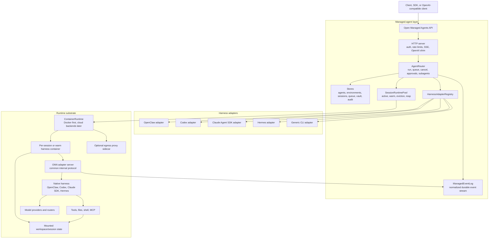

# Strategy - open-managed-agents

Working strategy notes for the new repo.

Last substantive rewrite: 2026-04-30.

## Executive Thesis

Open Managed Agents is the agent-agnostic generalization of
`openclaw-managed-agents`.

It is not a fresh project starting from blank abstractions. It should inherit the
core product target, API shape, lifecycle model, and operational philosophy of
`openclaw-managed-agents`, then replace the hard OpenClaw/Pi assumption with a
harness adapter contract.

Sharp version:

> Open Managed Agents is the open version of Claude Managed Agents for any agent
> harness.

Shorter:

> OpenRouter for managed agents.

Market metaphor:

> Claude Managed Agents is the iOS path. Open Managed Agents is the Android path.

The target stays the same as the OpenClaw-specific project:

- Claude Managed Agents-shaped primitives.
- Self-hostable open-source managed-agent layer.
- Durable sessions.
- Isolated execution environments.
- Events and streaming.
- Tool policy and approvals.
- Subagents/delegation.
- Model/provider freedom.
- Practical deployment by developers and cloud OEMs.

The only strategic difference:

```text
openclaw-managed-agents:
  managed-agent layer for OpenClaw/Pi

open-managed-agents:
  managed-agent layer for OpenClaw, Codex, Claude Agent SDK, Hermes,
  Pi, OpenCode, and future harnesses
```

OpenClaw remains the flagship adapter because it owns the personal-agent brand.
Open Managed Agents is the wider platform.

## Runtime Layer Or Managed-Agent Layer

Calling this a "runtime layer" is technically reasonable, but incomplete.

Better language:

> Open Managed Agents is a managed-agent layer with a runtime substrate.

The distinction matters.

| Term | Meaning | Should we use it? |
|---|---|---|
| Agent harness | The loop/brain implementation: OpenClaw/Pi, Codex, Claude Agent SDK, Hermes | Yes, for adapter boundary |
| Container runtime | Docker/ECS/Kubernetes/Cloud Run process and sandbox substrate | Yes, for infrastructure backend |
| Runtime substrate | The internal machinery that spawns, warms, reaps, isolates, and observes execution | Yes, internally |
| Managed-agent layer | The product/API/control layer: agents, environments, sessions, events, policy, credentials, observability | Yes, public/default |

The user-facing claim should not be "we are a container runtime." That sounds too
low-level and confuses us with Docker, Firecracker, AgentCore Runtime, or
Kubernetes.

The stronger public claim:

> We provide the open managed-agent layer: the API and operational boundary that
> turns agent harnesses into safe, durable, product-ready managed agents.

Use "runtime" when talking about internals:

- session runtime
- sandbox runtime
- container runtime
- harness runtime
- managed-agent runtime substrate

Use "managed-agent layer" when talking about product category.

## Claude Managed Agents Standard

Claude Managed Agents is still the primary product standard.

The standard is not exact API cloning. The standard is the product primitive set:

- `Agent`: model, instructions, tools, MCP, skills, permissions, quotas.
- `Environment`: packages, files, runtime image, network policy, sandbox profile.
- `Session`: durable execution context with one or more turns.
- `Event`: append-only observable history with SSE/streaming.

The standard also includes behavior:

- async/background execution;
- long-running sessions;
- event history and streaming;
- cancellation/interruption/steering;
- tool approval;
- environment lifecycle;
- sandbox isolation;
- durable files/session state;
- usage/cost observability;
- recoverability after process failure;
- SDK/API ergonomics.

Open Managed Agents should be an open implementation of this product shape.

Not a Claude clone.
Not an Anthropic cloud clone.
Not a wrapper around one model.

The promise is:

> Claude Managed Agents-shaped managed-agent primitives, open to any harness and
> any model provider.

## Relationship To openclaw-managed-agents

`openclaw-managed-agents` is the reference implementation and first vertical
distro.

Open Managed Agents should copy its strongest decisions:

- API-first service.
- Four core primitives: `Agent`, `Environment`, `Session`, `Event`.
- Stateless orchestrator process.
- Durable metadata stores.
- Durable session event/state source.
- One isolated execution environment per active session.
- Containers as compute caches, sessions as durable resources.
- Active pool and warm pool.
- Queueing events posted while a session is running.
- Restart recovery.
- SSE event streaming.
- OpenAI-compatible adoption path.
- Tool permission policy.
- Approval flow.
- Subagents as first-class sessions.
- Limited networking.
- Vault/credential boundary work.
- Metrics, logs, audit, health endpoints.
- Small-VPS deployability.
- Developer-as-OEM positioning.

Open Managed Agents should change exactly the parts that make the current repo
OpenClaw-specific:

- `PiJsonlEventReader` becomes a harness-neutral event log interface.
- `GatewayWebSocketClient` becomes an adapter-specific control client.
- `OPENCLAW_*` spawn env becomes adapter-built runtime config.
- OpenClaw gateway HTTP calls become `HarnessAdapter.startTurn`.
- OpenClaw tool approval plugin becomes one implementation of a generic approval
  contract.
- OpenClaw/Pi session ids become adapter-native session metadata under a managed
  session id.
- OpenClaw runtime image becomes one runtime image among several.

This is not "build another platform."

It is:

> extract the managed-agent layer from OpenClaw Managed Agents and make the
> harness replaceable.

## Two Directions

Both projects can coexist.

| Project | Direction | Why it exists |
|---|---|---|
| `openclaw-managed-agents` | OpenClaw-specific managed-agent distro | Best first product for personal OpenClaw agents |
| `open-managed-agents` | Harness-agnostic managed-agent layer | General Android/OpenRouter layer for managed agents |

The docs should be largely related because the target is the same.

The divergence:

```text
openclaw-managed-agents:
  personal-first vertical product
  OpenClaw/Pi as the fixed harness
  fastest path to "my Claw" products

open-managed-agents:
  platform-first horizontal product
  OpenClaw as default/flagship harness
  Codex/Claude SDK/Hermes/etc. as replaceable drivers
```

Do not erase the OpenClaw wedge.

OpenClaw gives the emotional brand:

- personal;
- open;
- tool-rich;
- model-flexible;
- "my Claw" feeling.

Open Managed Agents gives the broader infrastructure story:

- managed portability;
- model/provider competition;
- cloud/OEM neutrality;
- no single harness lock-in.

## Category Map

Use layer language precisely.

| Layer | Job | Examples | Our relationship |
|---|---|---|---|
| Model router | Route inference across providers/models | OpenRouter, LiteLLM, ZenMux | We can consume this; not our main layer |
| Agent harness | Agent loop, tool protocol, local session semantics | OpenClaw/Pi, Codex App Server, Claude Agent SDK, Hermes, LangGraph, CrewAI | Harnesses become adapters |
| Managed-agent layer | Agent/session/environment/event API, policy, lifecycle, isolation, observability | Claude Managed Agents, openclaw-managed-agents, open-managed-agents | This is our layer |
| Container/sandbox runtime | Process/container/microVM execution substrate | Docker, ECS, Cloud Run, Kubernetes, Agent Sandbox, Firecracker | Internal backend |
| Workflow orchestrator | Decide what work should run, retry/reconcile tasks | OpenAI Symphony | Can run on top |
| Workspace/team app | Human collaboration around agents | Multica, Linear-like agent workspaces | Can run on top |
| Cloud/OEM SKU | IAM, billing, regions, support, compliance | Anthropic, AWS, future clouds | We enable this, not operate it ourselves |

Strategic mistake:

> competing at all layers.

Correct move:

> own the open managed-agent layer, with enough runtime substrate to be useful.

## Product Positioning

### Android Versus iOS

The closed path:

```text
Developer app
  -> Claude Managed Agents
  -> Anthropic managed runtime
  -> Anthropic harness
  -> Anthropic models
```

This is iOS:

- polished;
- coherent;
- easy;
- closed;
- premium priced;
- vendor controlled.

The open path:

```text
Developer app
  -> Open Managed Agents
  -> developer/cloud-OEM infrastructure
  -> OpenClaw/Codex/Claude SDK/Hermes/etc.
  -> any model/provider/router
```

This is Android:

- open;
- portable;
- cheaper;
- OEM-friendly;
- more fragmented;
- must be opinionated to stay usable.

The public sentence:

> Open Managed Agents is the Android path for Claude Managed Agents-style
> infrastructure.

### OpenRouter For Managed Agents

OpenRouter made the model interchangeable behind one developer surface.

Open Managed Agents should make the managed agent harness interchangeable behind
one developer surface.

Analogy:

```text
OpenRouter:
  one API surface
  many model providers
  price/performance competition

Open Managed Agents:
  one managed-agent API surface
  many agent harnesses
  model/framework/cloud competition
```

OpenRouter routes inference.

Open Managed Agents manages execution.

That difference matters. We are not only proxying requests. We own sessions,
state, isolation, tools, approvals, events, credentials, and lifecycle.

## Who Uses This

The user is a developer or cloud/OEM building agent products.

They are not buying "agent theory."

They need a service boundary:

- create an agent;
- create a session;
- send an event;
- stream events;
- inspect logs;
- approve tools;
- cancel/interrupt;
- cap spend;
- isolate workspace;
- recover after deploys;
- route to cheaper models;
- swap the harness if the product needs it.

Product builders:

- personal assistant apps;
- personal OpenClaw-style products;
- coding/devops agents;
- vertical workflow agents;
- support/ops agents with tools;
- finance/research agents;
- local-first or VPC-sensitive products;
- cloud providers packaging managed agents;
- workspace products that do not want to own runtime infra.

The reason they choose us:

> Direct harnesses are too raw. Closed managed agents are too locked. Building
> the managed layer themselves is too much infrastructure work.

## Why Direct Harnesses Are Not Enough

Direct OpenClaw, Codex, Claude Agent SDK, Hermes, or LangGraph is easier for a
demo.

It breaks when the product needs:

- many users;
- durable multi-turn sessions;
- background execution;
- event streaming;
- restart recovery;
- tool approval;
- cancellation/interruption;
- quotas and rate limits;
- cost accounting;
- credential boundaries;
- network policy;
- sandbox lifecycle;
- warm starts;
- audit logs;
- subagent visibility;
- deployment repeatability.

Direct harness usage is library integration.

Managed agents is product infrastructure.

## Why Not Claude Managed Agents Or Bedrock

Claude Managed Agents and Bedrock/AgentCore validate the need.

But closed vendor platforms have structural constraints:

- vendor model gravity;
- vendor cloud gravity;
- premium pricing;
- limited harness choice;
- limited runtime portability;
- weaker self-host/VPC story unless using the vendor's cloud;
- platform roadmap controlled by someone else.

OpenAI and Anthropic monetize model usage directly. They are not structurally
incentivized to make agent execution a cheap, open, model-competitive commodity.

That is the opening.

Open Managed Agents can use strong cheaper models and routers:

- DeepSeek;
- Moonshot/Kimi;
- Qwen;
- open-weight providers;
- OpenRouter-like routers;
- ZenMux-like routers;
- future commodity inference.

The managed-agent layer becomes the place where cheap model competition turns
into product economics.

## Multica Assessment

Multica is agent-agnostic as a workspace/task product.

It detects installed local agent tools, registers one runtime per
`workspace x daemon x provider`, creates local workdirs, invokes CLIs, and
normalizes task messages/results.

That is adapter-agnostic.

It is not the same as a harness-agnostic managed-agent layer.

Multica's current execution center is:

```text
user machine daemon x installed AI coding CLI
```

Open Managed Agents' execution center should be:

```text
managed session API x isolated runtime x harness adapter
```

Sharp distinction:

> Multica manages work assigned to many agents. Open Managed Agents manages the
> runtime contract that makes agents safe, durable, and product-ready.

Multica could become a client of Open Managed Agents if it wants real cloud
managed execution.

## What To Keep From openclaw-managed-agents

This is the key engineering instruction.

Do not throw away working infrastructure.

| Area | Keep? | Reason |
|---|---:|---|
| Hono HTTP server | Yes | API shape is already close to Claude Managed Agents primitives |
| `Agent`, `Environment`, `Session`, `Event` public model | Yes | This is the standard |
| SQLite-backed stores | Yes | Good v1 self-host persistence |
| QueueStore per session | Yes | Correct for events posted while running |
| Session status machine | Yes | Useful managed lifecycle boundary |
| `SessionContainerPool` active/warm pool idea | Yes | Core runtime substrate |
| Docker backend | Yes | Best default self-host backend |
| Limited networking sidecar | Yes | Important Claude parity/security feature |
| Auth/rate limiting | Yes | Necessary for public API |
| Pino logs and Prometheus metrics | Yes | Operationally useful |
| OpenAI-compatible endpoint | Yes | Adoption path |
| Python/TypeScript SDK direction | Yes | Developer distribution |
| Deploy scripts | Yes | Small-OEM install path |
| Subagents as first-class sessions | Yes | Strong product/observability model |
| Parent-token lineage model | Yes | Generalize beyond OpenClaw |
| Vault/secret work | Yes | Needs hardening, but direction is right |
| Portal | Maybe | Useful inspector, but do not drift into Multica workspace app |

## What Must Change

| Current OpenClaw-specific part | Generalized Open Managed Agents version |
|---|---|
| `PiJsonlEventReader` is the event source | `ManagedEventLog` interface, with OpenClaw/Pi JSONL as one adapter source |
| `GatewayWebSocketClient` is attached to every pool entry | Adapter-owned `ControlClient` with capability-gated methods |
| Router builds `OPENCLAW_*` env vars | Harness adapter builds spawn spec/config |
| Router calls OpenClaw `/v1/chat/completions` | Router calls `HarnessAdapter.startTurn` |
| OpenClaw gateway session key is canonical | Managed session id is canonical; native session id is adapter metadata |
| Tool approval depends on OpenClaw plugin | Generic approval event contract; OpenClaw plugin is one implementation |
| MCP shape passes through to `openclaw.json` | MCP becomes managed config mapped per adapter |
| Thinking level is Pi/OpenClaw-specific | Capability-gated reasoning config |
| Runtime image pins `openclaw` | Multiple harness runtime images |
| `openclaw-call-agent` CLI | Generic `oma-call-agent` injected into compatible runtimes |
| `OPENCLAW_*` env names | `OMA_*` platform env plus adapter-specific env |
| Events are not stored by orchestrator | Orchestrator owns normalized event log for non-native adapters |
| Warm-pool compatibility only considers OpenClaw config | Warm-pool signature includes adapter kind, image, capabilities, config, secrets generation |

## Target Architecture



## Harness Adapter Contract

The harness adapter is the new core abstraction.

It lives above `ContainerRuntime`.

`ContainerRuntime` answers:

> How do I spawn/stop/inspect an isolated execution unit?

`HarnessAdapter` answers:

> How do I run a managed agent session inside that execution unit?

Rough contract:

```ts
type HarnessKind =
  | "openclaw"
  | "codex"
  | "claude_agent_sdk"
  | "hermes"
  | "pi"
  | "opencode"
  | "generic_cli";

type HarnessCapabilities = {
  streaming: boolean;
  cancel: boolean;
  interrupt: boolean;
  toolApprovals: boolean;
  mcp: boolean;
  dynamicModelPatch: boolean;
  compaction: boolean;
  nativeSessionResume: boolean;
  usage: boolean;
  subagents: boolean;
};

interface HarnessAdapter {
  kind: HarnessKind;
  capabilities(config: AgentRuntimeConfig): HarnessCapabilities;

  buildSpawnSpec(ctx: SpawnContext): SpawnOptions;
  waitReady(ctx: ReadyContext): Promise<void>;

  startTurn(ctx: TurnContext): Promise<TurnResult>;

  cancel?(ctx: SessionControlContext): Promise<void>;
  interrupt?(ctx: SessionControlContext, message: string): Promise<void>;
  compact?(ctx: SessionControlContext): Promise<void>;
  confirmTool?(
    ctx: SessionControlContext,
    approvalId: string,
    decision: "allow" | "deny"
  ): Promise<void>;

  listEvents(ctx: SessionContext): Promise<ManagedEvent[]>;
  followEvents?(ctx: SessionContext): AsyncIterable<ManagedEvent>;
}
```

Do not promise semantic equality.

Promise managed portability.

## Internal Adapter Protocol

To avoid turning the orchestrator into a pile of native protocols, each harness
runtime image should expose a small common adapter server.

```text
GET  /readyz
POST /sessions/:id/turns
POST /sessions/:id/cancel
POST /sessions/:id/interrupt
POST /sessions/:id/compact
POST /sessions/:id/approvals/:approval_id
GET  /sessions/:id/events
GET  /sessions/:id/outcome
GET  /logs
```

For OpenClaw, the adapter can wrap:

- OpenClaw gateway HTTP;
- OpenClaw gateway WS control plane;
- Pi/OpenClaw JSONL.

For Codex, the adapter can wrap:

- Codex App Server / JSON-RPC;
- Codex session/thread id;
- Codex event stream.

For Claude Agent SDK, the adapter can wrap:

- SDK stream;
- SDK tool hooks;
- SDK session/resume semantics where available.

For Hermes, the adapter can wrap:

- Hermes/ACP protocol;
- native session metadata;
- event stream.

The orchestrator should speak one managed adapter protocol.
The adapter should speak native harness protocol.

## Managed Event Log

The event log is the spine of managed agents.

OpenClaw Managed Agents currently gets this by reading Pi/OpenClaw JSONL. That is
excellent for OpenClaw, but not enough for an agent-agnostic platform.

Open Managed Agents needs a normalized durable event log.

Baseline event types:

- `user.message`
- `user.tool_confirmation`
- `agent.message`
- `agent.thinking`
- `agent.tool_call`
- `agent.tool_result`
- `agent.tool_confirmation_request`
- `agent.status`
- `agent.error`
- `agent.usage`
- `session.started`
- `session.cancelled`
- `session.compaction`
- `session.delegation_started`
- `session.delegation_completed`

Adapter event sourcing:

| Adapter | Event source |
|---|---|
| OpenClaw | Read native Pi/OpenClaw JSONL and/or mirror into managed log |
| Codex | Capture app-server/JSON-RPC notifications and append managed events |
| Claude SDK | Capture SDK stream and append managed events |
| Hermes | Capture ACP/native stream and append managed events |
| Generic CLI | Parse stdout/stderr with weaker guarantees and mark capability limits |

Important rule:

> The public API reads managed events. Native events are adapter implementation
> details.

OpenClaw JSONL can remain a trusted native source, but the public platform cannot
be Pi-JSONL-shaped forever.

## Capability-Gated Compatibility

Agent-agnostic does not mean every harness supports every feature.

The platform should expose a capability matrix and reject unsupported operations
loudly.

| Capability | OpenClaw | Codex | Claude SDK | Hermes | Generic CLI |
|---|---:|---:|---:|---:|---:|
| Start turn | yes | yes | yes | yes | yes |
| Streaming events | yes | yes | yes | likely | maybe |
| Native resume | yes | yes | likely | likely | maybe |
| Cancel | yes | yes | likely | likely | process kill |
| Interrupt/steer | yes | maybe | maybe | maybe | no |
| Tool approvals | yes via plugin | maybe | SDK hooks maybe | maybe | no/weak |
| MCP | yes | depends | depends | depends | no/weak |
| Compaction | yes | maybe | maybe | maybe | no |
| Usage/cost | yes | yes/partial | yes/partial | partial | weak |
| Subagents | yes via injected CLI | yes if tool/shell | yes if tool hook | maybe | weak |

This table should become tested metadata, not marketing copy.

## Data Model Direction

Agent config needs a runtime block.

```ts
type AgentConfig = {
  agentId: string;
  name?: string;

  runtime: {
    kind: HarnessKind;
    image?: string;
    config: Record<string, unknown>;
  };

  model?: string;
  instructions?: string;
  tools?: string[];
  mcpServers?: Record<string, unknown>;
  permissionPolicy?: PermissionPolicy;
  quota?: Quota;
  callableAgents?: string[];
  maxSubagentDepth?: number;
};
```

Session config needs native metadata.

```ts
type Session = {
  sessionId: string;
  agentId: string;
  runtimeKind: HarnessKind;
  nativeSessionId?: string;
  nativeThreadId?: string;
  status: "idle" | "starting" | "running" | "failed" | "cancelled";
  capabilitySnapshot: HarnessCapabilities;
};
```

Environment config needs to stay mostly compatible with Claude Managed Agents:

```ts
type Environment = {
  environmentId: string;
  packages?: {
    apt?: string[];
    pip?: string[];
    npm?: string[];
    cargo?: string[];
    gem?: string[];
    go?: string[];
  };
  networking?: "unrestricted" | {
    type: "limited";
    allowedHosts: string[];
  };
  files?: Record<string, string>;
  runtimeImage?: string;
};
```

## Current Status

This repo currently contains strategy only.

The implementation should not start from scratch.

The correct implementation path is:

1. Copy or port the working `openclaw-managed-agents` codebase into this repo.
2. Keep behavior identical with only naming/build changes.
3. Extract OpenClaw-specific pieces behind `OpenClawHarnessAdapter`.
4. Introduce managed event log abstraction.
5. Add one second real adapter.
6. Only then claim agent-agnostic execution.

## Extraction Plan From openclaw-managed-agents

### Phase 0 - Strategy

- [x] Create repo.
- [x] Create strategy doc.
- [x] Recenter strategy as a generalization of `openclaw-managed-agents`.

### Phase 1 - Baseline Port

- [ ] Copy the current orchestrator/runtime/store/server/SDK/deploy structure.
- [ ] Rename project-level labels from OpenClaw-specific to Open Managed Agents
      where they are platform-level.
- [ ] Keep OpenClaw runtime as the only working adapter.
- [ ] Do not change behavior yet.
- [ ] Keep tests passing.

### Phase 2 - Adapter Boundary

- [ ] Create `src/harness/adapter.ts`.
- [ ] Move `buildSpawnOptions` OpenClaw env construction into
      `OpenClawHarnessAdapter`.
- [ ] Move OpenClaw `/v1/chat/completions` invocation into adapter.
- [ ] Move OpenClaw WS control calls behind adapter control methods.
- [ ] Move Pi JSONL mapping behind adapter event source.
- [ ] Keep the public API unchanged.

### Phase 3 - Managed Event Log

- [ ] Define `ManagedEventLog`.
- [ ] Implement SQLite or file-backed normalized event log.
- [ ] Keep OpenClaw JSONL read-through initially.
- [ ] Add optional mirroring from OpenClaw JSONL to managed events.
- [ ] Make server/router read through the event interface.

### Phase 4 - Second Adapter

- [ ] Choose Codex or Hermes as the first non-OpenClaw adapter.
- [ ] Build a runtime image with the common adapter server.
- [ ] Implement start/resume/cancel/events.
- [ ] Add harness contract tests.
- [ ] Publish capability matrix from code.

### Phase 5 - Claude SDK Adapter

- [ ] Add Claude Agent SDK runtime image.
- [ ] Map SDK stream to managed events.
- [ ] Map tool hooks to approval events where possible.
- [ ] Document exactly what differs from Claude Managed Agents.

### Phase 6 - Cloud Backends

- [ ] Keep Docker as default.
- [ ] Add runtime backend factory.
- [ ] Explore ECS/Fargate, Cloud Run, Kubernetes, and Agent Sandbox.
- [ ] Do not block the product on this.

## Comparison

| Aspect | Open Managed Agents | openclaw-managed-agents | Claude Managed Agents | Bedrock AgentCore | Symphony | Multica |
|---|---|---|---|---|---|---|
| Primary layer | Managed-agent layer | Managed-agent layer for OpenClaw | Closed managed-agent platform | AWS enterprise agent platform | Workflow orchestration | Workspace/task app |
| Harness | Pluggable | OpenClaw/Pi | Claude harness | Any framework in AWS model | Usually Codex | Local CLIs |
| Main standard | Claude Managed Agents-shaped primitives | Same | Native | AWS/AgentCore | Issue/workflow spec | Workspace/task model |
| Execution owner | Self-host/OEM | Self-host/OEM | Anthropic | AWS | User/operator | Local daemon/cloud app |
| Event model | Managed normalized log | Pi/OpenClaw JSONL projected | First-class persisted events | Traces/streams/observability | Logs/status | Task messages |
| Isolation | Runtime substrate, Docker first | Docker per active session | Managed containers | MicroVM/session isolation | Implementation-defined | Local workdir/CLI sandbox |
| Model choice | Any provider/router per adapter | Any OpenClaw provider/router | Anthropic | Bedrock/external via AWS path | Underlying agent | Underlying CLI |
| Openness | OSS platform | OSS vertical distro | Proprietary | Proprietary AWS | OSS orchestrator | OSS app |
| Best at | Open Android layer for managed agents | Personal OpenClaw product wedge | Claude-native polish | Enterprise AWS governance | Issue-agent orchestration | Human workspace UX |
| Main risk | Adapter complexity and fake uniformity | Too OpenClaw-specific | Lock-in/pricing | AWS gravity | Not runtime layer | Not true managed runtime |

## Strategic Rules

1. Do not start from scratch.

   Use `openclaw-managed-agents` as the working base.

2. Do not dilute the target.

   The target is still an open Claude Managed Agents-style product layer.

3. Do not fake parity.

   Harness differences must be explicit and capability-gated.

4. Do not become Multica.

   A portal/inspector is fine. A workspace/issue app is a different layer.

5. Do not become Symphony.

   Workflow orchestration should run on top, not become core.

6. Do not become only a model router.

   OpenRouter analogy is about openness and interchangeability. Our product owns
   execution lifecycle, not just inference routing.

7. Keep OpenClaw as the flagship.

   Agent-agnostic does not mean brandless. OpenClaw is the best default harness
   for personal-agent products.

## Open Questions

- Should `openclaw-managed-agents` remain a separate vertical distro forever, or
  eventually become `open-managed-agents` with `runtime.kind = "openclaw"`?
- Should the first non-OpenClaw adapter be Codex or Hermes?
- Should managed events be stored in SQLite, JSONL, or both?
- Should OpenClaw JSONL be mirrored into managed events or read-through forever?
- How much exact Claude Managed Agents API compatibility is useful versus
  misleading?
- What is the minimum adapter capability set before we call a harness
  "supported"?
- Should `ContainerRuntime` be renamed to avoid confusion with harness runtime?
- Should public package names use `oma`, `open-managed-agents`, or something
  more brandable?

## Immediate TODO

- [ ] Add a repo `README.md` with the sharp positioning.
- [ ] Add an `AGENTS.md` for this repo explaining that it generalizes
      `openclaw-managed-agents`.
- [ ] Port the current codebase into this repo without changing behavior.
- [ ] Add `docs/architecture.md` describing the adapter boundary.
- [ ] Define `HarnessAdapter` and `ManagedEventLog` interfaces before adding any
      second adapter.
- [ ] Write an explicit keep/change migration checklist from the current
      OpenClaw-specific code.
- [ ] Decide first second adapter: Codex if we want OpenAI/Symphony relevance,
      Hermes if we want OpenClaw ecosystem continuity.

## Decision

Build Open Managed Agents as the horizontal project.

Keep `openclaw-managed-agents` untouched for now.

Treat it as the reference vertical implementation.

The next engineering move is not invention.

It is extraction:

```text
OpenClaw-specific managed runtime
  -> OpenClaw adapter
  -> harness-agnostic managed-agent layer
```

